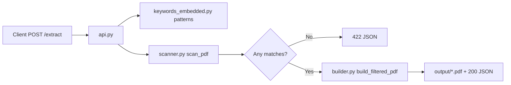

# PDF-Extraction — workflow and file reference

## Main entry point

The **main** runnable module is **`api.py`**. Start the application with:

```bash
python api.py
```

That launches the Flask server (default `http://127.0.0.1:8000`). There is no separate CLI script; HTTP requests drive processing.

---

## Where the workflow starts

1. **At process start** — Flask loads `api.py`, which imports configuration from `keywords_embedded.py` and imports `scan_pdf` from `scanner.py` and `build_filtered_pdf` from `builder.py`.
2. **Per request** — The workflow **begins** when a client sends **`POST /extract`** with a PDF in the multipart field `file`. The handler in `api.py` validates the upload, writes it to a temp file, then calls the scanner and (if there are matches) the builder.

---

## Request flow (high level)



| Step | What happens |
|------|----------------|
| 1 | `api.py` saves the upload to a temporary PDF path. |
| 2 | `scanner.scan_pdf()` opens the PDF with PyMuPDF, extracts text per page, and records pages where any phrase from `PATTERN_DEFINITIONS` appears (case-insensitive substring). |
| 3 | If no page matches, the API returns **422** with no output file. |
| 4 | If there are matches, `builder.build_filtered_pdf()` copies only those pages into a new PDF under **`output/`**. |
| 5 | The API returns JSON with page numbers, relative path to the filtered PDF, totals, and comparable-sales/rental flags derived from pattern groups in `keywords_embedded.py`. |

---

## File purposes

| File | Purpose |
|------|---------|
| **`api.py`** | Flask application: defines **`POST /extract`**, validates multipart uploads (PDF only, non-empty), wires `PATTERN_DEFINITIONS` into `scan_pdf`, computes comparable-sales/rental flags, calls `build_filtered_pdf`, returns the standard JSON envelope, and runs the dev server when executed as `__main__`. |
| **`scanner.py`** | PDF text scanning: opens the document with **PyMuPDF** (`fitz`), runs **`get_text()`** on each page, and returns a mapping of **0-based page index → list of matched pattern labels** plus total page count. Raises `RuntimeError` if the PDF cannot be opened. |
| **`builder.py`** | Filtered PDF assembly: opens the source PDF, creates a new empty document, **`insert_pdf`** copies only matched pages (preserving native page content), saves to the given path, and ensures the output directory exists. |
| **`keywords_embedded.py`** | **Configuration** for matching: phrase strings, **`PATTERN_DEFINITIONS`** (label → exact phrase), and tuples **`COMPARABLE_SALES_PATTERN_KEYS`** / **`COMPARABLE_RENTAL_PATTERN_KEYS`** used by the API to set boolean flags in the JSON `data`. Edit this file to change what text triggers a page to be kept. |
| **`requirements.txt`** | Python dependencies: **pymupdf** (PDF I/O and text extraction) and **flask** (HTTP API). |
| **`README.md`** | Human documentation: setup, how to run, API contract, response shapes, and configuring phrases. |
| **`output/`** | **Runtime output directory** (created on first successful extraction). Filtered PDFs are written here with names like `{original_stem}_filtered_{short-uuid}.pdf`. Not versioned as source code; it is where the service writes files. |

---

## Summary

- **Main file:** `api.py` (run + HTTP entry).
- **Logical start of work:** `POST /extract` in `api.py`, after validation.
- **Data/config source for phrases:** `keywords_embedded.py`.
- **Core pipeline:** `scanner.py` (find pages) → `builder.py` (write subset PDF).
